# Ensuring Quality Releases
This project demonstrates the capabilities of automated CI/CD pipelines using Azure DevOps.

The CI/CD pipeline consists of four stages:
* Stage 1. [Infrastructure](#infrastructure)
* Stage 2. [Build](#build)
* Stage 3. [Deploy](#deploy)
* Stage 4. [Test](#test)

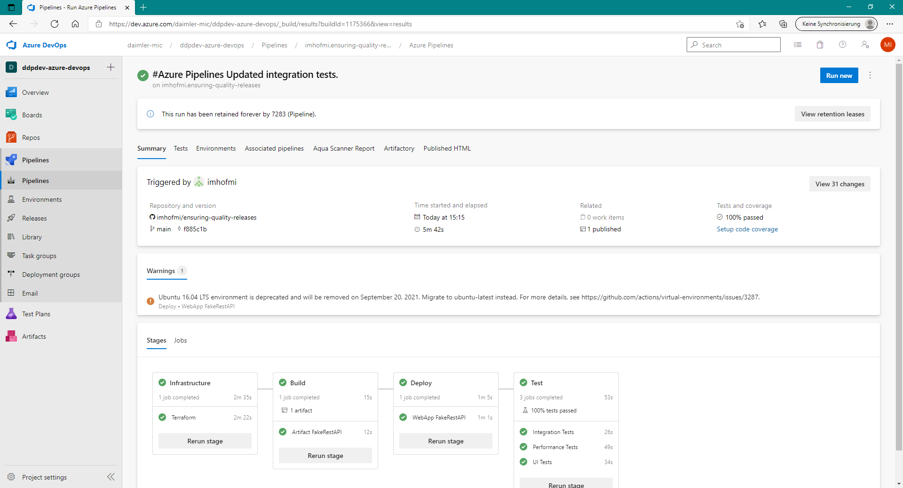

## Infrastructure

Infrastructure is described as code that is instantiated and managed by Terraform.

The Infrastructure stage uses the terraform configuration in the 'terraform' directory to perform the following tasks:

* Install Terraform
* Terraform Init
* Terraform Plan
* Terraform Apply

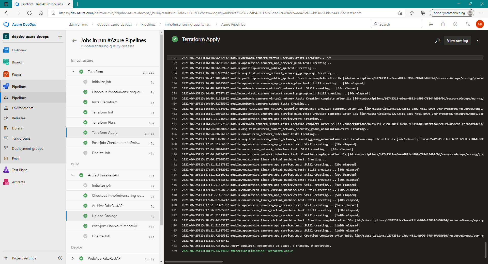

## Build

The Build stage packages the FakeRestAPI web application contained in the 'fakerestapi' directory into an artifact.

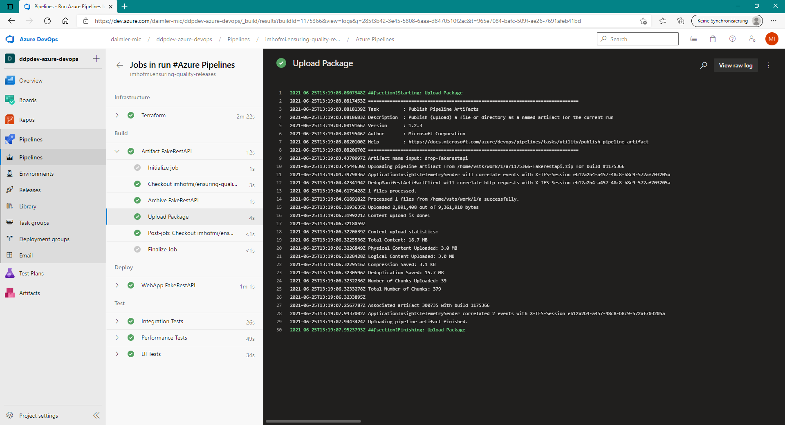

## Deploy

The Deploy stage deploys the artifact generated in the Build stage to the Azure AppService created in the Infrastructure stage.

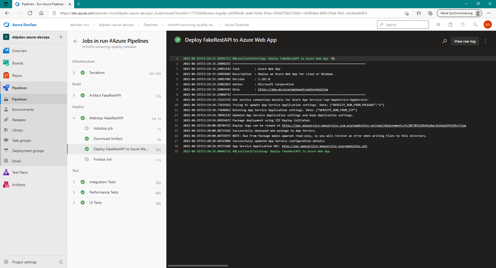

## Test

The Test stage consists of performs three different steps:
* [Integration Tests](#integration-tests)
* [Performance Tests](#performance-tests)
* [UI Tests](#-ui-tests)

### Integration Tests

Integration Tests are performed to check the APIs provided by the webapp for existence (regression) and correctness (validation).

The tests were created using Postman and can be found in 'automatedtesting/postman'.

Execution within the pipeline is done via newman.

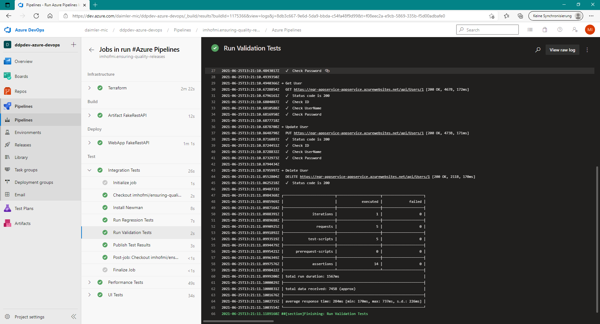

Test results are uploaded to the pipeline and are directly visible:

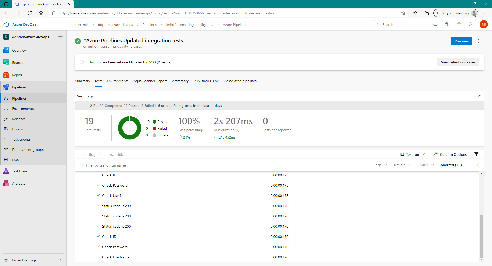

### Performance Tests

Performance Tests ensure that the webapp can handle the expected load in different situations.

JMeter is used to perform two types of performance tests:

* Stress Test: High load during short period of time.

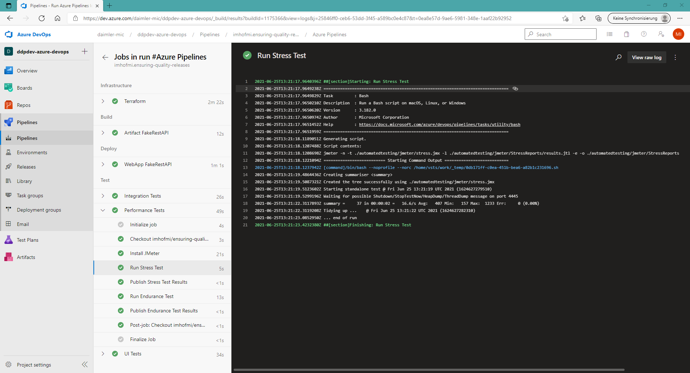

* Endurance Test: Constant load over long period of time.

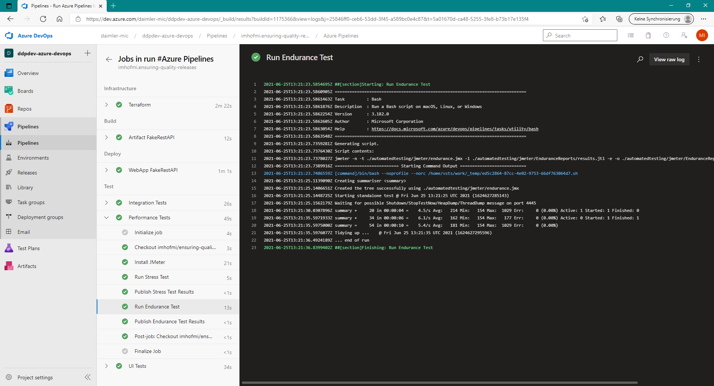

<!-- Test results are uploaded to the pipeline and are directly visible:  -->
<!--  -->

### UI tests

UI Tests ensure that the functionality of an app works as expected.

Selenium is used to test a web shop by adding items to a cart and removing them.

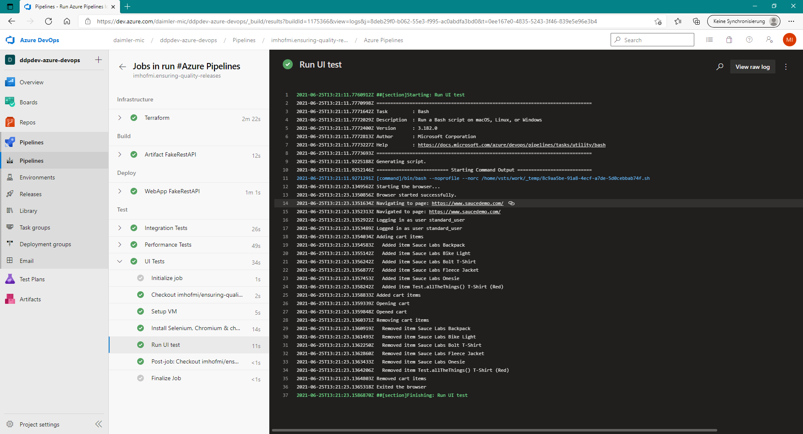

## Monitoring

### Alerting

An alert is triggered whenever too many 404 errors occur:

It automatically generates eMails as shown below:

### Logging

Azure log analytics is used for the webapp http logs:

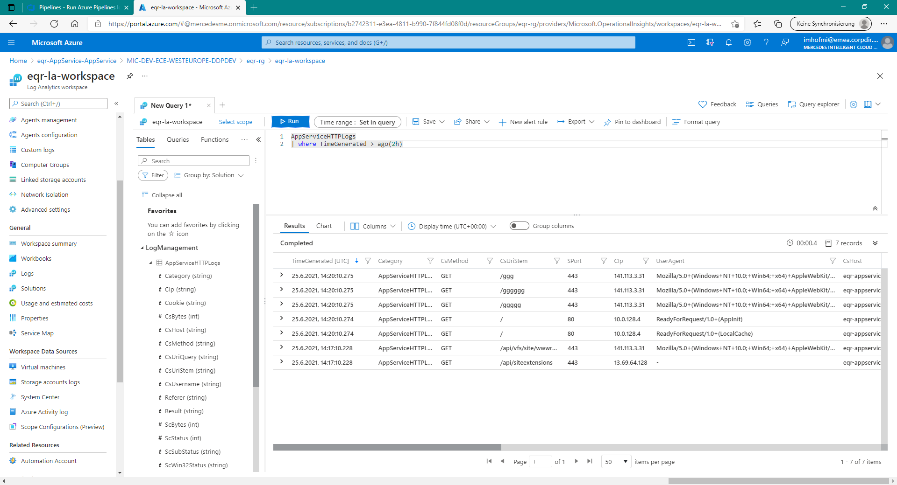

And is also used for the UI test logs produced by selenium:

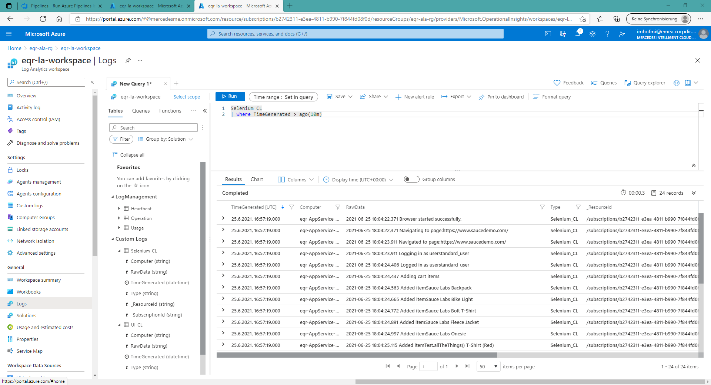